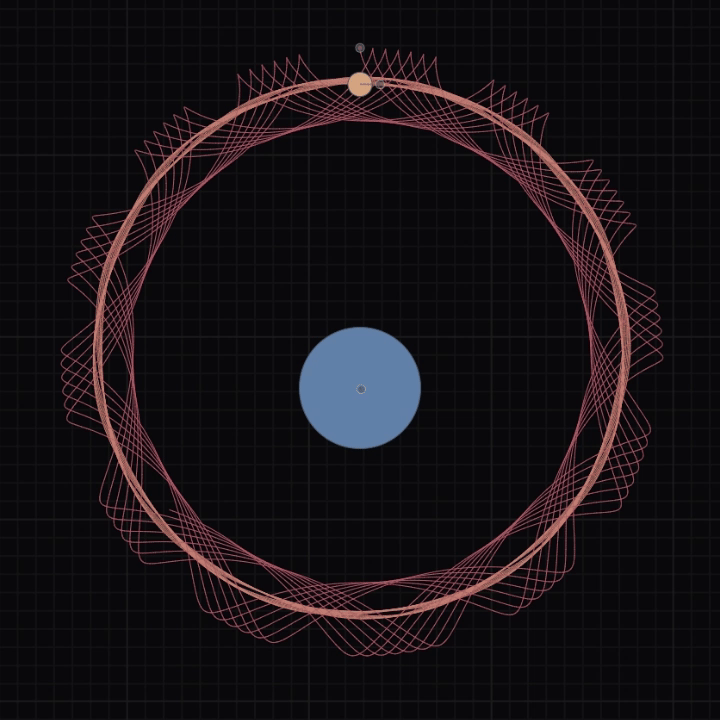

[](https://planet.jpbhatt.tech/)    

### Planetarium is an interactive simulator that models the gravitational dynamics of celestial bodies in a 2D environment, enabling real-time visualization and analysis of orbits.

#### Try planetarium [here](https://planet.jpbhatt.tech/).

## Features
- Real-time N-body gravitational simulation  
- Customizable initial conditions (mass,radius, position, velocity)  
- Interactive camera controls (zoom, pan)  
- Orbital trails and forecast

## Installation
1. Clone the repo:  
   ```bash
   git clone https://github.com/jpbhatt21/Planetarium.git
   cd planetarium
   ```
2. Install dependencies:  
   ```bash
   npm install
   ```

## Usage
```bash
npm run dev
```
Use the GUI to set simulation parameters, then press **Space** to launch the simulation.

## Configuration
Edit Universal Variables to adjust:  
- `Speed`: simulation time step  
- `Gravitational Constant`: simulation G
- `Collision Energy Loss`: simulation Elastic Constant
- `Forecast Limit` : number of steps to forecast
- `Trail Limit`: number of steps to show in the trail
- `Anchor` : anchor body for the camera
- `Scale` : zoom level of the camera

Export & Import simulation settings via JSON files.

## Examples of Use
- **Solar System Demo**: Preloaded Sun, Mercury, Venus, Earth, Mars, Jupiter  
- **Custom Scenarios**: Create your own scenarios by adding celestial bodies with custom mass, radius, position, and velocity.

## Demo

## License
Distributed under the MIT License.

